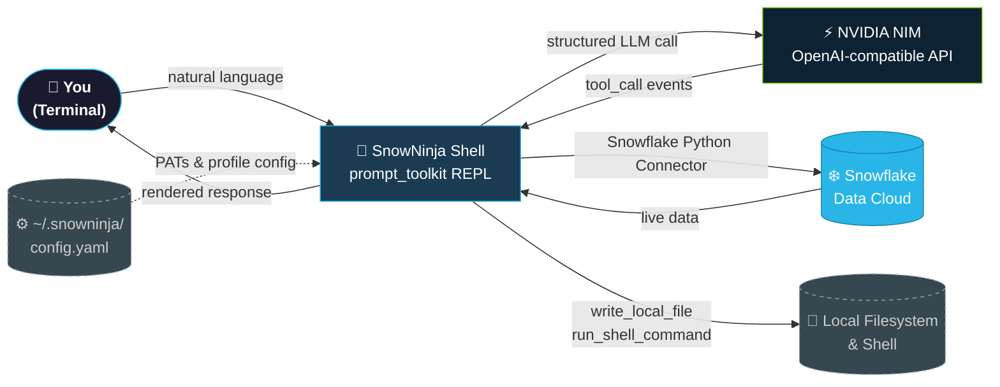

# ❄️ SnowNinja CLI

**The Principal Architect’s Workbench for the Snowflake Ecosystem.**

[](https://www.nvidia.com/en-us/ai-data-science/generative-ai/nim/)
[](https://www.snowflake.com/)

SnowNinja is a high-performance, agentic TUI (Terminal User Interface) designed for Snowflake engineers and architects. It provides a production-grade autonomous agent harness backed by **NVIDIA NIM** models, enabling full-cycle data engineering—from requirement gathering to live pipeline implementation—directly from your terminal.

---

## 🎨 System Overview



---

## 🥷 The Agentic Philosophy

SnowNinja operates on a **Dual-Lane Execution Model**, separating reasoning from implementation to ensure maximum architectural integrity:

1.  **📐 The Planner Lane:** Backed by `meta/llama-4-maverick-17b-128e-instruct` (via NIM). The Planner focuses on high-level reasoning, Snowflake architecture, and environment exploration. It produces structured **Task Lists**.
2.  **⚙️ The Implementer Lane:** Backed by `qwen/qwen3-coder-480b-a35b-instruct` (via NIM). The Implementer consumes the Planner's task list and executes live Snowflake operations (DDL, DML, Python, Shell) to build the solution.

---

## 🚀 Installation

### Option 1: Global Tool (Recommended)
Install SnowNinja as a global tool available from any directory:
```bash
git clone https://github.com/Jericho2010/TUI-snowNinja-cli.git
cd TUI-snowNinja-cli
uv tool install .
```

### Option 2: Local Development
```bash
# 1. Clone and Initialize
git clone https://github.com/Jericho2010/TUI-snowNinja-cli.git
cd TUI-snowNinja-cli
./setup.sh

# Optional: seed local environment variables
cp .env.example .env

# 2. Configure Credentials
snowninja setup

# 3. Verify Connection
snowninja doctor

# 4. Launch the Cockpit
snowninja
```

---

## 🛠️ Development Workflow

```bash
make test
make lint
make format
```

- `.env.example` documents the expected Snowflake and NVIDIA environment variables.
- `.pre-commit-config.yaml` runs the same Ruff and file hygiene checks before commit.
- CI now runs lint plus the unit and CLI test suites on pushes and pull requests.

---

## 💎 Feature Matrix

| Feature | Description | Status |
| :--- | :--- | :--- |
| **Dual-Lane Loop** | Separate Planner/Implementer lanes for architectural rigor. | ✅ Production |
| **Resilient NIM Client** | Auto-fallback chain (Llama → Mistral → Qwen) for 100% uptime. | ✅ Production |
| **Runtime Model Visibility** | Toolbar and `/models` reflect the currently active lane model after fallback. | ✅ Production |
| **Snowflake Action Tools** | 45+ built-in tools for UC, Cortex, Warehouses, and Pipelines. | ✅ Production |
| **Governance Guardrails** | Blocks critical Snowflake mutations and oversized warehouse changes before execution. | ✅ Production |
| **Interactive Interview** | `/interview` mode for guided requirements gathering. | ✅ Production |
| **Dynamic Skill Router** | RAG-style injection of domain-specific Snowflake guides. | ✅ Production |
| **Project Scaffolding** | `/scaffold` for instantly creating Medallion/Snowpark repos. | ✅ Production |
| **Safe Shell Execution** | Gated subprocess execution for local ops (git, uv, snow). | ✅ Production |

---

## 📂 Documentation

*   [**Architecture Reference**](docs/ARCHITECTURE.md): Deep-dive into the async loops, fallback chains, and tool integration.
*   [**Command Manual**](docs/COMMANDS.md): Comprehensive guide to slash commands, shell workflows, and non-interactive CLI commands.
*   [**Launch Strategy**](docs/LAUNCH_POST.md): Announcement template for high-engagement release.

---

## 🛡️ Security & Privacy

SnowNinja is designed with a **"Private by Design"** architecture:
- **No Hardcoded Secrets**: Your Snowflake credentials and NVIDIA API keys are never stored in this repository.
- **Local Persistence**: All sensitive data is stored in `~/.snowninja/config.yaml` on your local machine.
- **Safe Execution**: Local shell commands are gated by a strict allowlist.
- **Governance Enforcement**: Critical SQL such as `DROP DATABASE`, `DROP SHARE`, `ALTER TABLE ... DROP COLUMN`, `REVOKE ALL`, and warehouse sizes above `X-LARGE` are blocked before execution.

For more details, see [SECURITY.md](SECURITY.md).

---

## 🤝 Contributing

We welcome contributions! Please see [CONTRIBUTING.md](CONTRIBUTING.md) for guidelines on reporting bugs or submitting pull requests.

---

## 📋 Build Log

| Date | Action | Summary |
| :--- | :--- | :--- |
| 2026-05-06 | Init | Ported architectural blueprint from BricksNinja; implemented Dual-Lane loop. |
| 2026-05-07 | Snowpark | Integrated Snowflake-native tools for UC, Cortex, and Warehouses. |
| 2026-05-08 | Global Tool | Professionalized installation via `uv tool install`; fixed command-not-found errors. |

---

## 📜 License

Built with ❄️ and 🥷 by the SnowNinja Team. Part of the TUINinja ecosystem. Licensed under the MIT License.
