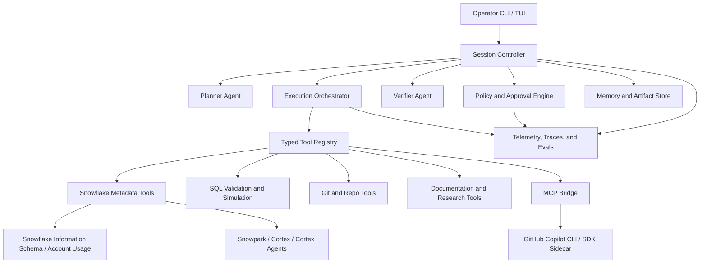

# Shaun's Snowflake CoCo CLI
## Transformation Blueprint: Bespoke Agent Harness

**Project Code:** SENTINEL-SNOWFLAKE-G3  
**Document Type:** Research-backed transformation plan  
**Status:** Expanded and grounded against the current repository and current agent tooling

---

## 1. Executive Summary

The current `SHAUN_SNOWFLAKE_COCO_CLI.md` described a compelling vision, but it was still closer to a mood board than an implementation blueprint. This rewrite turns it into a practical transformation plan for evolving the current JARVIS-style CLI into a **Snowflake-focused Bespoke Agent Harness**: a governed, typed, inspectable, multi-agent operator system for architecture work, metadata analysis, SQL generation, migration design, cost control, and delivery support.

This plan is deliberately grounded in three realities:

1. **What already exists in this repo** - a lightweight Python CLI, model router, skill registry, harness delegation concept, and SQLite-backed memory.
2. **What modern agent infrastructure now supports** - typed tool execution, MCP connectivity, custom agents, human approval gates, observability, and background delegation.
3. **What a Snowflake-focused enterprise harness actually needs** - policy, auditability, lineage awareness, cost controls, and separation between planning, execution, and verification.

The result should not be "just another chat wrapper." It should become a **principal architect workbench** with explicit roles, deterministic tool contracts, governed execution, and the ability to recruit external agent runtimes such as GitHub Copilot CLI where they are genuinely useful.

---

## 2. Why This Spec Needed Expansion

The previous version had energy, but it lacked enough of the following:

- a review of the existing codebase
- a realistic migration path from the current Python implementation
- explicit agent roles and system boundaries
- typed contracts for tools, tasks, and outputs
- policy, approval, and audit design
- observability and evaluation strategy
- a credible assessment of GitHub Copilot CLI and SDK capabilities
- a Snowflake-native execution and governance model

In short: it described a destination without defining the vehicle, the road, the checkpoints, or the guardrails.

---

## 3. Current-State Review of This Repository

The present codebase already contains useful primitives. It is not a Snowflake harness yet, but it is not starting from zero.

| Current asset | Evidence in repo | What it already gives us | What is still missing |
| --- | --- | --- | --- |
| Basic CLI shell | `src/cli.py` | Interactive and one-shot command entry | No command taxonomy, no task graph, no operator views |
| Core conversational loop | `src/core.py` | Central prompt, history, recursive tool loop | Tool calls are prompt-parsed JSON blocks rather than true typed execution |
| Model router | `src/nexus.py` | Multi-model switching and provider abstraction | No policy-aware routing, no workload classes, no cost or latency governance |
| Skill registry | `src/skill_manager.py` | Discovery and dynamic execution of local skills | No typed schemas, no approval policy, no capability metadata |
| Harness concept | `src/skills/harness.py`, `data/skills/harness.md` | External delegation to another CLI runtime | Currently hard-wired and fragile; not a governed agent interoperability layer |
| Persistent memory | `src/memory_engine.py`, `src/memory_manager.py` | SQLite persistence and some searchable state | No scoped memory model, retention policy, trace linkage, or artifact indexing |
| Scheduling idea | `src/chronos_engine.py` | Seed of deferred execution | No durable workflow engine, approval queue, or retry semantics |

### Current architectural truth

Today the repo is best understood as a **persona-rich single-agent shell with dynamic skills**, not yet as a production-grade agent harness.

### Immediate gaps against the Snowflake target

- no Snowflake authentication or connection abstraction
- no Snowflake metadata adapters
- no SQL safety layer
- no approval workflow for destructive actions
- no typed planner/executor/verifier roles
- no observability or OpenTelemetry traces
- no evaluation harness
- no MCP-first integration surface
- no enterprise governance model
- no clear distinction between research, planning, execution, and promotion

---

## 4. Research Findings That Should Shape the New Design

This section captures the core findings from current platform research and how they should alter the plan.

### 4.1 GitHub Copilot CLI is now more than a terminal chatbot

Current GitHub Copilot CLI documentation and changelog show that it now supports:

- **custom agents**
- **skills**
- **MCP server integration**
- **background delegation to Copilot cloud agent**
- **autopilot for local autonomous execution**
- **parallel subagent execution via `/fleet`**
- **task monitoring and steering**

That matters because it means Copilot CLI is no longer just a coding assistant; it is itself an **agent harness environment** with:

- tool permissions
- subagents
- project-scoped customization
- repo and user level agent definitions
- cloud and local execution modes

### 4.2 There is now a real GitHub Copilot SDK path

Current Microsoft Agent Framework documentation shows an official path for using **GitHub Copilot as an SDK-backed agent provider**, including:

- a `.NET` path via `Microsoft.Agents.AI.GitHub.Copilot`
- a Python path via `agent-framework-github-copilot --pre`
- support for:
  - session management
  - function tools
  - permission handlers
  - MCP servers
  - streaming
  - OpenTelemetry-backed observability

This is important: **the answer is no longer "Copilot CLI has no SDK story."** It does. But it should be used carefully and intentionally.

### 4.3 PydanticAI is a strong fit for the harness core

Current PydanticAI guidance aligns unusually well with what this repo lacks:

- typed dependencies
- typed outputs
- tool schemas
- capability composition
- durable execution patterns
- graph-based orchestration
- human-in-the-loop approval
- observability and eval support

For this project, PydanticAI is attractive not because it is fashionable, but because it directly addresses the current gap between:

- prompt-shaped orchestration (`src/core.py`)
- and system-shaped orchestration (typed state, typed tools, typed results)

### 4.4 Snowflake itself now provides native AI surfaces worth using

Current Snowflake documentation indicates that the harness should not treat Snowflake as a passive database. It can be an active agent substrate via:

- **Cortex AI functions**
- **Cortex Agents**
- **Snowpark**
- **Information Schema and Account Usage metadata**
- **governance and lineage facilities**

That means the Bespoke Agent Harness should treat Snowflake as both:

1. **a system to act upon**
2. **a source of grounded intelligence and governance**

### 4.5 Treat Snowflake's own platform surfaces as the implementation substrate

The harness should not build a parallel Snowflake universe that reimplements what Snowflake already provides well.  
The better move is to treat the Snowflake platform and developer toolchain as the implementation substrate, then wrap those surfaces into one coherent operator experience.

### Core substrate surfaces to wrap

- **Snowflake CLI** for connection profiles, SQL execution, object management, stage flows, Streamlit management, Native App workflows, and developer-centric project operations
- **Snowpark** for programmatic data work, packaging, stored procedure and function logic, and typed application code that executes in Snowflake
- **Cortex AI functions and Cortex Agents** for in-platform AI, grounded retrieval, and governed tool use inside Snowflake's security perimeter
- **Information Schema, Account Usage, lineage, tags, masking, and policy metadata** for discovery, policy grounding, and change impact analysis
- **Streamlit in Snowflake** as the optional in-account app surface for dashboards, operator consoles, and guided runbooks
- **Snowflake Native App Framework** for packaging and distribution patterns when the harness needs a productized app surface
- **Git repository clones in Snowflake** for repo-backed execution, handler packaging, and promotion-aware deployment flows
- **Snowflake logging, tracing, and event tables** for OpenTelemetry-aligned runtime observability on in-platform code paths

### Consequence

The Shaun Snowflake CoCo CLI should add what the substrate does not:

- a unified experience layer
- orchestration across those substrate surfaces
- safer defaults and approvals
- run history and artifact summaries
- opinionated bootstrap, deploy, govern, trace, and eval workflows
- explicit external intelligence lanes for planning and implementation

### 4.6 NVIDIA NIM is a strong external model plane for planner and implementer modes

Current NVIDIA NIM documentation matters here for one reason: it exposes an OpenAI-compatible chat API at `https://integrate.api.nvidia.com/v1/chat/completions`, supports streaming, and keeps model selection as a runtime parameter rather than a baked-in product decision.

That makes it a very practical fit for the Snowflake harness as an **external intelligence plane** above the Snowflake execution substrate.

### Recommended NIM model-lane stance

The harness should support assignable NIM-backed lanes such as:

- **Planner lane** for decomposition, migration thinking, architecture alternatives, policy-aware reasoning, and multi-step change planning
- **Implementer lane** for SQL drafting, dbt scaffolds, Snowpark code generation, Streamlit scaffolds, Native App packaging drafts, and runbook generation

The default model families should be chosen from the current NIM catalog rather than hard-coded forever. The catalog already exposes strong candidate families for this split, including:

- **DeepSeek v4** variants for high-end implementation and reasoning
- **Qwen** latest reasoning and coder variants for planner or implementer assignment
- **Kimi** instruct or thinking variants for long-context planning and document-heavy work
- **GLM** latest variants for structured planning and tool-oriented flows
- **Mistral** latest general and coding-capable variants for implementation or fallback lanes

### Important boundary

NIM should drive the harness's planning and implementation cognition.  
It should **not** directly bypass Snowflake policy, approval, identity, or execution controls.

---

## 5. Decision: Should GitHub Copilot CLI or the Copilot SDK Be Used Inside This Harness?

**Short answer:** yes, but as a **companion capability**, not as the system of record for Snowflake execution.

### Recommended position

The Shaun Snowflake CoCo CLI should remain its **own primary orchestration surface** for Snowflake-centric work. GitHub Copilot should be integrated in specific roles where its strengths are decisive:

- repository-aware coding help
- documentation drafting
- background implementation of local changes
- code review and refactoring
- MCP-enabled access to external tool ecosystems
- sidecar research or operator assistance

### What Copilot should not own

Copilot should **not** become the authority for:

- Snowflake access policy
- approval rules for destructive warehouse or schema actions
- audit storage
- run history for regulated operations
- cost governance enforcement
- promotion between environments

### Recommended integration patterns

| Integration pattern | What it means | Fit | Verdict |
| --- | --- | --- | --- |
| **Operator workbench** | The Snowflake harness exposes tools; Copilot CLI is used by the operator as a companion terminal agent | Strong | **Adopt early** |
| **SDK sidecar agent** | A Copilot-backed subagent is invoked from the harness for coding, research, and repo tasks | Strong | **Adopt in phase 3 or later** |
| **MCP bridge consumer** | Copilot connects to the harness through MCP servers that expose Snowflake-safe tools | Very strong | **Core strategic direction** |
| **Primary runtime replacement** | Replace the harness core with Copilot entirely | Weak | **Do not do this** |

### Practical recommendation

Build the new harness so that:

1. **its own tool contracts remain first-class**
2. **GitHub Copilot can consume those contracts through MCP**
3. **Copilot-backed agents can be recruited as sidecars**
4. **all Snowflake-risking actions still flow through the harness policy layer**

---

## 6. Guiding Design Principles

The next version of the CLI should be designed around the following principles:

### 6.1 Typed before clever

If a planner emits work, the work item must have a schema.  
If a tool is callable, its inputs and outputs must have schemas.  
If an action mutates Snowflake, it must have a traceable approval path.

### 6.2 Provider-agnostic intelligence tier

The current spec hard-coded a model family. The better design is:

- **Reasoning tier** - deep planning and architecture
- **Implementation tier** - artifact generation, code and SQL drafting, and tool-guided build steps
- **Execution tier** - fast tool-heavy loops and verification orchestration
- **Snowflake-native tier** - Cortex capabilities for in-platform AI
- **Fallback tier** - resilient alternate providers through `Nexus`

This matches the current repo's multi-model instinct, but makes it governable.

For the external tier, NVIDIA NIM should be a first-class provider with separate assignments for:

- **plan mode** -> planner lane model
- **implement mode** -> implementer lane model

The operator should be able to swap those assignments without rewriting prompts or changing the harness architecture.

### 6.3 Human-in-the-loop by default for risky actions

Read-only analysis can be autonomous.  
Write operations should be tiered:

- safe and reversible -> auto-approved policy lane
- impactful but bounded -> approval required
- destructive or cross-environment -> explicit operator checkpoint

### 6.4 Research, plan, execute, verify must be different modes

The current repo mostly blends them. The new harness must separate them.

### 6.5 Auditability is a feature, not paperwork

For a Snowflake architect, the ability to explain:

- what the agent saw
- why it proposed an action
- what it executed
- what changed
- how much it cost

is part of the product.

### 6.6 Separate knowledge plane from action plane

The harness should not blur playbooks and prompts together with executable Snowflake actions.

- **Knowledge plane** - standards, playbooks, migration patterns, governance rules, semantic hints, and operator guidance
- **Action plane** - typed Snowflake tools, execution adapters, validation flows, and approval-gated mutations

This makes the system easier to test, safer to expose through MCP, and easier to evolve without turning every change into prompt surgery.

### 6.7 Treat MCP as interoperability, not identity

MCP should be the bridge that lets external agents and tools consume the harness safely.  
It should not become the definition of the product. The CLI and its policy model remain the center.

### 6.8 Evaluation and telemetry must be first-class

The harness should be designed so that quality can be measured continuously, not guessed from anecdotes.  
Snowflake's own event tables and OpenTelemetry-aligned telemetry make this especially important.

### 6.9 Scaffold, bootstrap, and govern flows are product features

This should not be only a chat shell. It should have explicit operator flows such as:

- `init`
- `doctor`
- `inspect`
- `plan`
- `apply`
- `deploy`
- `govern`
- `trace`
- `eval`

### 6.10 Every action should carry governance metadata

Every meaningful run should record:

- environment and account identity
- role used
- query tags
- approval receipt or change reference
- affected objects
- trace or run identifier

### 6.11 Setup and mode assignment must be native operator workflows

The user should not have to hand-edit config just to make the harness usable.

The CLI and any future TUI should include a first-run setup experience, exposed as:

- interactive slash command: `/setup`
- command form: `snow-agent setup`

That setup flow should:

1. ask whether the operator wants **hosted NIM** or a **self-hosted NIM base URL**
2. collect the NVIDIA API key or token reference
3. validate connectivity with a lightweight test request
4. present current catalog-backed recommended planner and implementer model defaults
5. let the operator assign a **planner model** and an **implementer model**
6. persist the configuration in a secure local profile or key store
7. optionally set fallback behavior if the preferred model is unavailable

The result should feel like a real harness bootstrap flow, not a README chore list.

---

## 7. Target Architecture



### Layer view

#### 7.1 Operator layer

- interactive CLI
- optional richer TUI
- task board
- approval prompts
- artifact browser
- run diff / plan diff / SQL diff views

#### 7.2 Orchestration layer

- planner
- task graph manager
- executor
- verifier
- approval coordinator
- escalation and retry logic

#### 7.3 Capability layer

- typed tool registry
- model routing
- MCP interoperability
- repo/code assistance
- Snowflake introspection and execution

#### 7.4 Governance layer

- policy engine
- approval engine
- environment rules
- audit log
- cost budgets

#### 7.5 Data and memory layer

- session state
- run artifacts
- knowledge cache
- long-term memory
- evaluation datasets

#### 7.6 Observability layer

- traces
- metrics
- prompt/run artifacts
- cost attribution
- tool failure analytics

---

## 8. Agent Roles in the Bespoke Harness

The system should not operate as one shapeless "super-agent." It should use explicit role boundaries.

| Agent role | Primary responsibility | Allowed actions |
| --- | --- | --- |
| **Planner** | Turn user intent into a task graph with success criteria | Read-only, no mutation |
| **Architect** | Propose Snowflake design patterns, medallion structures, migration approaches | Read-only, draft artifacts |
| **Metadata Scout** | Inspect schemas, tables, lineage, usage, privileges | Read-only against metadata sources |
| **Implementer** | Produce SQL, dbt, Snowpark, Streamlit, Native App, and operational artifacts from approved plans | Draft only until verified |
| **SQL Builder** | Generate candidate SQL, dbt models, Snowpark scaffolds | Draft only until verified |
| **Verifier** | Validate SQL, compare outputs, run dry-runs, cross-check policy | No production writes |
| **Governance Sentinel** | Enforce permissions, tags, data domain rules, environment restrictions | Approval and denial only |
| **Cost Sentinel** | Estimate query/warehouse impact and watch for runaway operations | Stop, warn, require approval |
| **Copilot Sidecar** | Repo-centric coding, documentation, code review, background implementation tasks | Limited to approved repo/tool lanes |

This role split reduces hallucinated authority and creates a natural approval funnel.

---

## 9. Proposed Codebase Evolution

The current code should evolve from persona-centric modules into capability-centric modules.

```text
src/
  harness/
    app.py
    session.py
    config.py
    models.py
    runtime/
      planner.py
      executor.py
      verifier.py
      policy.py
      approvals.py
      scheduler.py
    providers/
      nexus_router.py
      copilot_sidecar.py
      snowflake_provider.py
    tools/
      registry.py
      metadata.py
      sql_validate.py
      sql_execute.py
      lineage.py
      cost.py
      git_ops.py
      docs_ops.py
    memory/
      session_store.py
      artifact_store.py
      knowledge_index.py
    observability/
      tracing.py
      metrics.py
      evals.py
    ui/
      cli.py
      tui.py
```

### How current files map into the new architecture

| Current file | Future role |
| --- | --- |
| `src/core.py` | seed for session controller, but should be decomposed |
| `src/nexus.py` | keep as provider router foundation |
| `src/skill_manager.py` | evolve into typed tool and capability registry |
| `src/skills/harness.py` | evolve into `copilot_sidecar.py` or a general agent bridge |
| `src/memory_engine.py` | evolve into structured memory and artifact storage |
| `src/chronos_engine.py` | evolve into scheduler/workflow coordinator |

---

## 10. Tooling and Contract Model

The current JSON-snippet tool pattern in `src/core.py` is a useful prototype, but it is not sufficient for a real harness. The new design should move to explicit typed contracts.

### Example contract shape

```python
from pydantic import BaseModel, Field


class SqlPlanRequest(BaseModel):
    objective: str
    environment: str = Field(pattern="^(dev|test|prod)$")
    allow_writes: bool = False
    include_lineage: bool = True


class SqlPlanResult(BaseModel):
    summary: str
    sql: list[str]
    risks: list[str]
    requires_approval: bool
```

### Contract rules

- every tool gets typed input/output
- tools declare whether they are read-only, mutating, or destructive
- tools declare required approval level
- tools emit trace IDs
- tools emit artifacts, not just strings
- failed validation becomes a first-class result, not an exception hidden in logs

---

## 11. Snowflake-Specific Capability Map

The Snowflake harness should organize its capability set into explicit tool families.

### 11.1 Metadata and discovery

- enumerate databases, schemas, tables, views, stages, tasks, pipes
- inspect grants, tags, masking policies, row access policies
- retrieve query history, warehouse usage, lineage metadata, dependency data
- summarize environment topology for a planner agent

### 11.2 SQL generation and validation

- generate candidate DDL/DML
- parse and lint SQL before execution
- run safe simulation or explain-plan workflows where available
- compare candidate SQL against policy rules and naming conventions

### 11.3 Migration and modeling

- source-to-target mapping
- medallion design proposals
- dbt project scaffolding
- dynamic table, task, and stream recommendations
- Snowpark job scaffolding

### 11.4 Governance and safety

- detect PII or sensitive domains through tags and policy metadata
- block unapproved writes against protected environments
- require rationale and checkpointing for high-risk changes
- track query tags for all agent actions

### 11.5 AI-native Snowflake integration

- use Cortex AI functions where they reduce round-trips
- use Cortex Agents selectively for grounded enterprise workflows
- use Snowpark for programmatic enrichment, packaging, and model-adjacent workflows

### 11.6 Developer, packaging, and app surfaces

- wrap Snowflake CLI capabilities instead of rebuilding every developer workflow from scratch
- support Snowpark project scaffolds and repository-backed handler packaging
- support Streamlit in Snowflake deployment and inspection as an operator-facing surface
- support Native App packaging patterns when the harness needs to distribute or productize capability
- support Git clone synchronization and repo-backed execution paths inside Snowflake

---

## 12. Policy, Security, and Approval Model

This is the section that separates an enterprise harness from a demo.

### 12.1 Permission tiers

| Tier | Examples | Default behavior |
| --- | --- | --- |
| **Observe** | metadata inspection, docs lookup, lineage read | auto-allow |
| **Draft** | SQL generation, dbt model generation, migration plan output | auto-allow |
| **Simulate** | explain plans, dry-runs, estimate queries, test schemas | allow with trace |
| **Mutate bounded** | dev schema changes, temp object creation, staging objects | approval or policy-gated |
| **Mutate critical** | prod DDL, grant changes, warehouse controls, policy changes | explicit human checkpoint |

### 12.2 Safety controls

- environment allowlists
- object pattern restrictions
- max query cost / time budgets
- automatic tagging of agent-issued queries
- approval receipts attached to every mutating run
- immutable audit log of proposed versus executed actions

### 12.3 Identity model

Prefer service and role separation:

- read-only architect role
- dev-write execution role
- prod-change role requiring approval handoff

The harness should never hide which role executed an action.

---

## 13. Memory, State, and Knowledge

The current SQLite memory approach is a useful seed, but the future design needs sharper boundaries.

### 13.1 Memory classes

- **session memory** - active conversation, plan, tool results
- **working memory** - task graph, pending approvals, transient artifacts
- **episodic memory** - past runs, resolved incidents, architecture decisions
- **reference memory** - playbooks, Snowflake standards, naming rules, domain policies

### 13.2 What should be stored

- plan revisions
- generated SQL candidates
- validation results
- final approved actions
- links to run artifacts
- lessons from failed attempts

### 13.3 What should not be stored casually

- secrets
- raw sensitive customer data
- unrestricted warehouse dumps
- prompt transcripts containing protected values without redaction

---

## 14. Observability and Evaluation

This is a non-negotiable workstream.

### 14.1 Observability

Adopt OpenTelemetry-aligned tracing for:

- prompt entry
- planner output
- tool invocations
- approvals
- retries
- execution results
- token and cost attribution

Use two layers of telemetry:

- **harness-level traces** for planning, routing, approvals, and external tool orchestration
- **Snowflake-native traces and logs** through event tables for Snowpark handlers, procedures, functions, and in-platform application paths

Both PydanticAI and the GitHub Copilot agent framework now point in this direction, which makes interoperability much easier, and Snowflake's telemetry model gives the in-platform side a natural home.

### 14.2 Evaluation harness

The project should maintain a curated benchmark set covering:

- metadata question answering
- schema migration planning
- SQL correctness
- governance compliance
- cost awareness
- approval behavior
- regression against known Snowflake edge cases

### 14.3 Success measures

- fewer invalid SQL proposals
- faster architecture draft cycles
- higher dry-run success rate
- lower rate of unsafe or blocked actions
- trace completeness for every production-affecting run
- measurable coverage across `plan`, `apply`, `deploy`, `govern`, and `eval` workflows

---

## 15. Operator Experience: CLI, TUI, and External Agent Interop

The prior spec proposed a Go + Bubble Tea TUI. That is possible, but the current repo is entirely Python, so the transformation plan should be pragmatic.

### Recommended UX sequence

1. **Phase 1:** strengthen the Python CLI first
2. **Phase 2:** add richer terminal UX in Python if needed
3. **Phase 3:** only introduce a Go TUI if packaging, responsiveness, or deployment constraints justify it

### Command model that should become first-class

The operator shell should explicitly support lifecycle commands such as:

- `setup` for first-run guided configuration and secure credential capture
- `init` for project and environment bootstrap
- `doctor` for auth, role, policy, and environment diagnostics
- `inspect` for metadata, lineage, usage, and topology discovery
- `plan` for design, migration, and change proposals
- `implement` for generating SQL, dbt, Snowpark, Streamlit, and app artifacts from a reviewed plan
- `apply` for bounded approved mutations
- `deploy` for repo-backed object, Streamlit, or app promotion flows
- `govern` for tags, masking, policies, and access review workflows
- `models` for viewing or changing planner and implementer model assignments
- `trace` for run and telemetry inspection
- `eval` for benchmark and regression workflows

### Interactive shell and TUI controls should expose the same modes

Inside the interactive harness, support slash workflows such as:

- `/setup`
- `/models`
- `/mode plan`
- `/mode implement`
- `/assign planner deepseek-ai/deepseek-v4-pro`
- `/assign implementer qwen/qwen3-coder-480b-a35b-instruct`

The TUI should surface the same controls as a visible mode switcher and profile editor rather than hiding them behind config files.

### Why not jump straight to Bubble Tea

- it creates a second runtime too early
- the repo does not currently justify the cross-language complexity
- Python-first tools can get much of the way there

### Where GitHub Copilot fits into operator UX

GitHub Copilot CLI can complement the harness in at least four ways:

1. **Deep repo assistance** while the harness remains focused on Snowflake domain work
2. **Background implementation** of generated scaffolds, docs, and tests via delegation
3. **Custom-agent workflows** for repeatable modernization or governance tasks
4. **MCP-connected operator console** where Copilot consumes the harness's safe tools

---

## 16. Concrete Transformation Roadmap

### Phase 0 - Reality alignment

**Objective:** stop pretending the current repo is already the target system.

Deliverables:

- current-state architecture note
- capability inventory
- gap analysis
- decision on first-class framework choices

### Phase 1 - Harness core

**Objective:** convert prompt-driven orchestration into typed runtime orchestration.

Deliverables:

- typed session state
- typed tool registry
- planner/executor/verifier roles
- model routing policy
- planner-mode and implementer-mode assignments
- artifact persistence
- `/setup` bootstrap wizard

### Phase 2 - Snowflake foundations

**Objective:** make the harness genuinely Snowflake-aware.

Deliverables:

- Snowflake connection abstraction
- Snowflake CLI adapter strategy
- metadata explorer tools
- SQL validation flow
- read-only environment summary commands
- query tagging strategy
- Git, Streamlit, and app-surface wrapping plan

### Phase 3 - Governance and approval

**Objective:** make the system safe enough to trust.

Deliverables:

- approval engine
- environment restrictions
- audit log
- cost sentinel
- policy rule pack

### Phase 4 - Copilot interoperability

**Objective:** recruit GitHub Copilot where it adds leverage.

Deliverables:

- Copilot sidecar adapter
- MCP bridge strategy
- repo-scoped custom agent profiles
- coding/delegation workflows

### Phase 5 - Operator experience

**Objective:** make the harness pleasant and legible under real use.

Deliverables:

- structured CLI commands
- richer terminal views
- plan/task/run inspection
- approval queue UX
- model-lane switcher for plan versus implement mode

### Phase 6 - Evals and release hardening

**Objective:** prove reliability instead of narrating it.

Deliverables:

- benchmark suite
- regression scenarios
- trace dashboards
- event-table-backed observability queries
- runbooks
- release criteria

---

## 17. Example High-Value Workflows

### 17.1 Medallion migration assessment

Input:

> "Map this legacy source schema into a Snowflake bronze/silver/gold design and show the tradeoffs."

Harness path:

1. Planner decomposes the request.
2. Metadata Scout gathers source and target constraints.
3. Architect drafts candidate medallion design.
4. SQL Builder drafts objects and dbt structure.
5. Verifier validates naming, joins, and risk areas.
6. Operator receives an artifact bundle, not just chat output.

### 17.2 Governance-safe SQL execution

Input:

> "Create the dev staging objects for this ingestion pipeline."

Harness path:

1. Draft SQL.
2. Simulate and validate.
3. Run policy check.
4. Present approval checkpoint.
5. Execute with trace and query tags.
6. Record results and rollback hints.

### 17.3 Cost anomaly response

Input:

> "Why did warehouse spend spike this morning?"

Harness path:

1. Query usage metadata.
2. Identify workload pattern and offending jobs.
3. Produce human-readable explanation.
4. Recommend bounded remediations.
5. Only allow actioned warehouse changes behind approval.

---

## 18. Risks and Anti-Patterns to Avoid

### 18.1 Persona inflation without system design

The repo already has strong identity and voice. Keep that. But do not confuse voice with architecture.

### 18.2 Hard-coding a single model vendor into the spec

The real strength here is controlled multi-provider routing, not vendor lock-in theater.

### 18.3 Treating every capability as "one more skill"

The current skill registry is useful, but the next system needs a distinction between:

- lightweight skills
- typed tools
- orchestrated workflows
- external agents

### 18.4 Letting Copilot own regulated execution paths

Copilot is powerful, but Snowflake execution must remain governed by this harness.

### 18.5 Building UI before policy

Do not make the dashboard prettier before the execution engine becomes safe.

---

## 19. Recommended Strategic Choices

If the transformation starts now, these are the strongest choices:

| Area | Recommendation |
| --- | --- |
| Substrate strategy | Wrap Snowflake CLI, Snowpark, Cortex, governance metadata, Git integration, Streamlit, Native Apps, and telemetry rather than bypassing them |
| Core runtime | Python-first harness with typed contracts |
| Orchestration | PydanticAI-style agents and graph/workflow patterns |
| Model routing | Keep and evolve `Nexus` into a policy-aware router with explicit NIM planner and implementer lanes |
| Interoperability | MCP-first external tool boundary |
| Copilot integration | Companion agent plus SDK-backed sidecar, not replacement runtime |
| Snowflake interface | Metadata-first, validate-first, approval-gated execution |
| Memory | Structured artifacts plus scoped memory classes |
| Observability | OpenTelemetry-compatible tracing from day one |
| UI | Strengthen CLI first; delay Go TUI until justified |

---

## 20. Research References to Keep in View

### GitHub Copilot

- [GitHub Copilot CLI README and command help](https://github.com/github/copilot-cli)
- [GitHub Docs: Invoking custom agents](https://docs.github.com/en/copilot/how-tos/copilot-cli/use-copilot-cli/invoke-custom-agents)
- [GitHub Docs: Delegating tasks to Copilot](https://docs.github.com/en/copilot/how-tos/copilot-cli/use-copilot-cli/delegate-tasks-to-cca)
- [GitHub Docs: Speeding up task completion with `/fleet`](https://docs.github.com/en/copilot/how-tos/copilot-cli/use-copilot-cli/speed-up-task-completion)
- [GitHub changelog: custom agents and delegation in Copilot CLI](https://github.blog/changelog/2025-10-28-github-copilot-cli-use-custom-agents-and-delegate-to-copilot-coding-agent/)
- [Microsoft Agent Framework: GitHub Copilot agents and SDK-backed usage](https://learn.microsoft.com/en-us/agent-framework/agents/providers/github-copilot)

### PydanticAI

- [PydanticAI overview](https://ai.pydantic.dev/)
- [PydanticAI agent core concepts](https://ai.pydantic.dev/docs/ai/core-concepts/agent)
- [PydanticAI tools and toolsets](https://ai.pydantic.dev/docs/ai/tools-toolsets/tools)
- [PydanticAI graph support](https://ai.pydantic.dev/docs/ai/graph/)
- [PydanticAI durable execution](https://ai.pydantic.dev/docs/ai/integrations/durable_execution/overview)
- [PydanticAI evals](https://ai.pydantic.dev/docs/ai/evals/)

### Snowflake

- [Snowflake CLI](https://docs.snowflake.com/en/developer-guide/snowflake-cli/index)
- [Snowflake Cortex AI functions](https://docs.snowflake.com/en/user-guide/snowflake-cortex/aisql)
- [Snowflake Cortex Agents](https://docs.snowflake.com/en/user-guide/snowflake-cortex/cortex-agents)
- [Snowpark developer guide](https://docs.snowflake.com/en/developer-guide/snowpark)
- [Streamlit in Snowflake](https://docs.snowflake.com/en/developer-guide/streamlit/about-streamlit)
- [Snowflake Native App Framework](https://docs.snowflake.com/en/developer-guide/native-apps/native-apps-about)
- [Snowflake Git integration overview](https://docs.snowflake.com/en/developer-guide/git/git-overview)
- [Snowflake logging, tracing, and metrics overview](https://docs.snowflake.com/en/developer-guide/logging-tracing/logging-tracing-overview)
- [Snowflake Account Usage reference](https://docs.snowflake.com/en/sql-reference/account-usage)
- [Snowflake data governance overview](https://docs.snowflake.com/en/user-guide/data-governance)

### NVIDIA NIM

- [NVIDIA NIM LLM APIs overview](https://docs.api.nvidia.com/nim/reference/llm-apis)
- [NVIDIA create chat completion reference](https://docs.api.nvidia.com/nim/reference/create_chat_completion_v1_chat_completions_post)

---

## 21. Final Position

The Shaun Snowflake CoCo CLI should evolve into a **governed Bespoke Agent Harness for Snowflake architecture and execution**, not merely a chatty CLI with a few helper scripts.

It should treat Snowflake's own developer, runtime, governance, and observability surfaces as the implementation substrate, then wrap them into a deliberate operator shell with approvals, memory, traces, evaluation, companion-agent interoperability, and native NIM-backed **plan** and **implement** modes inside the CLI or TUI.

The current repo already contains the seeds of that system:

- model routing
- skill execution
- delegation
- memory
- scheduling

But the transformation requires a decisive shift toward:

- typed contracts
- explicit agent roles
- policy and approval lanes
- observability
- evaluation
- MCP interoperability
- and selective use of GitHub Copilot CLI / SDK where it creates leverage

That is the path from "interesting prototype" to "serious architect-grade harness."
