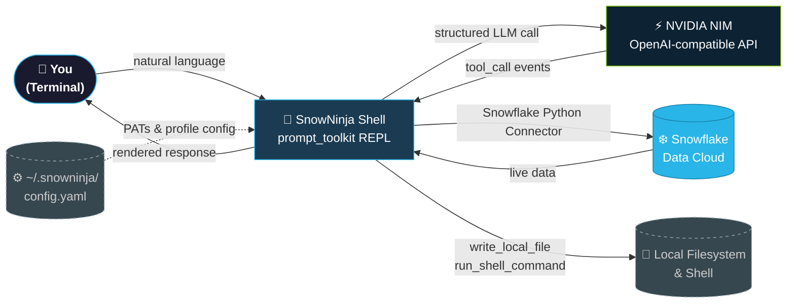
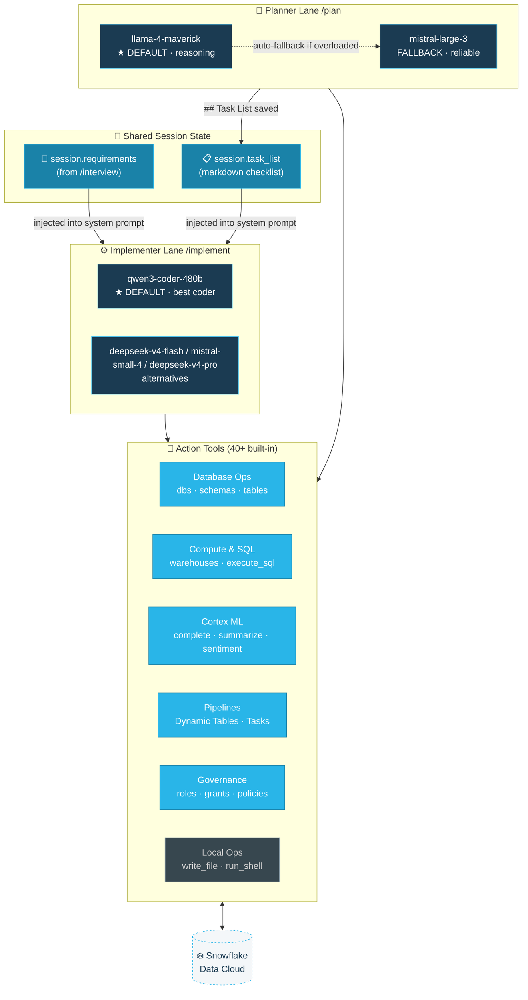
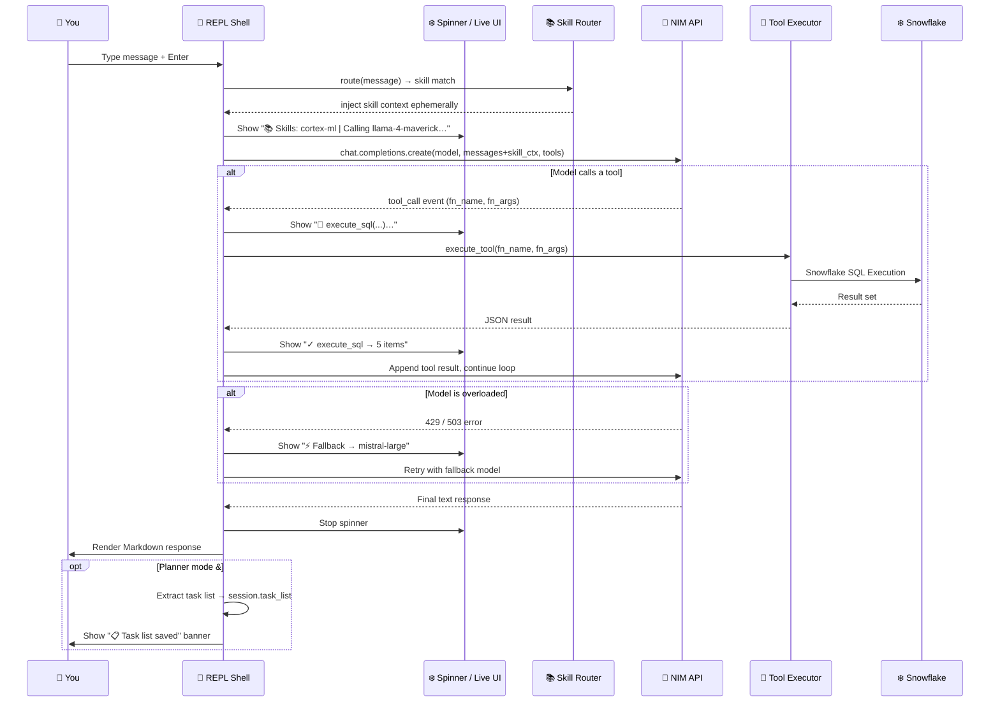
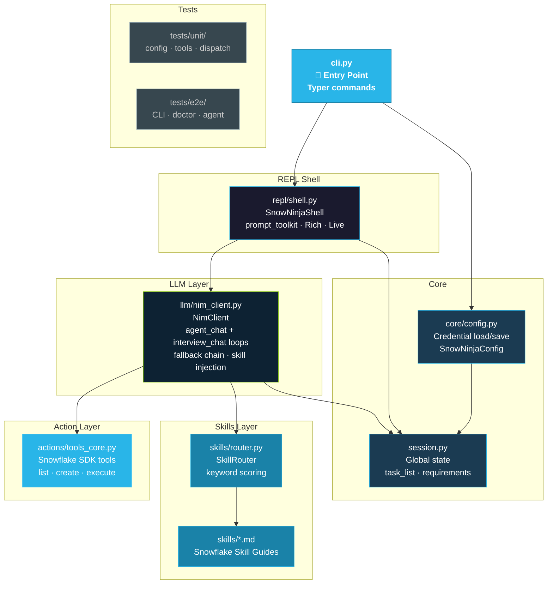
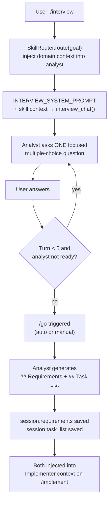

# SnowNinja — Architecture Reference

> **Living document.** Updated as the system evolves.
> Last updated: 2026-05-14 · [← Back to README](../README.md)

---

## Contents

1. [System Overview](#1-system-overview)
2. [Dual-Lane AI Design](#2-dual-lane-ai-design)
3. [Request Lifecycle](#3-request-lifecycle)
4. [Codebase Component Map](#4-codebase-component-map)
5. [Planner → Implementer: End-to-End Example](#5-planner--implementer-end-to-end-example)
6. [Skills Guidance Layer](#6-skills-guidance-layer)
7. [Guided Requirements Interview](#7-guided-requirements-interview)
8. [Snowflake Action Tools](#8-snowflake-action-tools)
9. [Project Structure](#9-project-structure)

---

## 1. System Overview

SnowNinja acts as an **intelligent broker** between the Snowflake Data Cloud, NVIDIA NIM’s generative power, and your local filesystem. It translates natural language intent into a structured tool-calling loop. When the LLM requires environmental context (e.g., "what tables are in the SALES schema?"), the shell executes a real Snowflake query and feeds the result back to the model, ensuring every plan is grounded in reality.

---

## 2. Dual-Lane AI Design

SnowNinja separates **Architectural Reasoning** from **Technical Execution**:
- **Planner lane**: Uses the highest-reasoning models (`llama-4-maverick`) to decompose complex goals into a structured `## Task List`.
- **Implementer lane**: Uses coding-specialized models (`qwen3-coder-480b`) to execute those tasks.
- **Shared Context**: The `session.task_list` is the source of truth that connects the two models.

---

## 3. Request Lifecycle

The lifecycle is built on **Async Generators**. The TUI does not block; it streams events (text chunks, tool calls, model switches) directly into the `Rich.Live` buffer.

---

## 4. Codebase Component Map

---

## 5. Guided Requirements Interview

The `/interview <goal>` command activates a dedicated **Requirements Analyst** persona.

The interview lane is isolated from the main agent history, preventing "context pollution" during long-running sessions.

---

## 6. Snowflake Action Tools

Full registry in `src/snowninja/actions/tools_core.py`.

| Category | Tools |
| :--- | :--- |
| **Metadata** | `list_databases`, `list_schemas`, `list_tables`, `describe_table`, `search_objects` |
| **Compute** | `list_warehouses`, `execute_sql` |
| **Cortex AI** | `cortex_complete`, `cortex_summarize`, `cortex_sentiment`, `cortex_extract` |
| **Pipelines** | `list_dynamic_tables`, `list_tasks`, `create_task` |
| **Governance** | `get_current_user`, `list_roles`, `list_grants` |
| **Local Ops** | `write_local_file`, `run_shell_command` |

---

## 7. Project Structure

- `src/snowninja/cli.py`: Typer entry point.
- `src/snowninja/llm/nim_client.py`: The agent loop and fallback mechanics.
- `src/snowninja/repl/shell.py`: The prompt-toolkit UI and slash commands.
- `src/snowninja/skills/`: Markdown skill guides for RAG-style injection.
- `tests/`: Comprehensive unit and E2E test suite.

---

*Part of [SnowNinja](../README.md) — The Principal Architect’s Shell.* 🥷❄️
